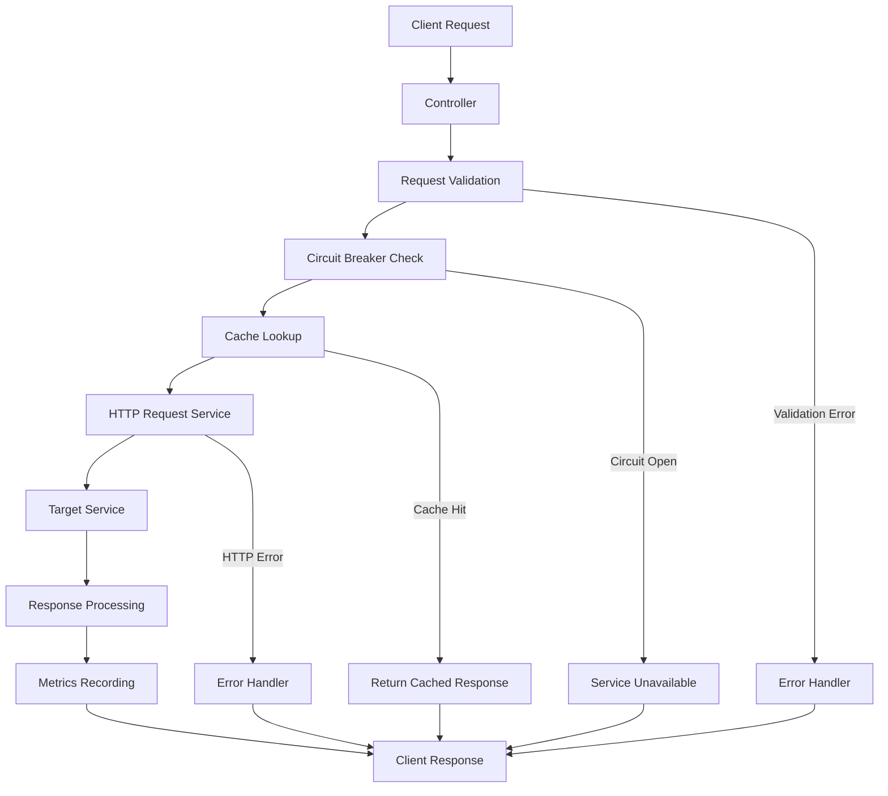

# Feign Gateway Architecture v2.0

## Overview

This document describes the enhanced architecture of the Feign Gateway project after implementing comprehensive code quality and maintainability improvements.

## 🏗️ **Architecture Evolution**

### **v1.0 - Basic Gateway**
```
Client → Controller → GatewayService → RestTemplate → Target Service
```

### **v2.0 - Enhanced Gateway**
```
Client → Controller → Validation → Circuit Breaker → Cache → HTTP Service → Target Service
         ↓              ↓              ↓           ↓
    Logging AOP    Error Handling   Metrics    Performance
```

## 🔧 **Core Components**

### **1. Request Processing Pipeline**



### **2. Service Layer Architecture**

#### **Core Services**
- **`GatewayService`**: Main orchestration service
- **`RequestValidationService`**: Input validation and sanitization
- **`HttpRequestService`**: HTTP communication abstraction
- **`WhitelistService`**: Security and access control
- **`CacheService`**: Multi-level caching system

#### **Supporting Services**
- **`CircuitBreakerService`**: Fault tolerance management
- **`PerformanceMetricsService`**: Metrics collection and reporting
- **`AsyncGatewayService`**: Asynchronous request processing
- **`StreamingService`**: Large response streaming

### **3. Error Handling Architecture**

#### **Exception Hierarchy**
```
GatewayException (Base)
├── ValidationException
│   ├── ServiceNameValidationException
│   ├── PathValidationException
│   └── MethodValidationException
├── ServiceUnavailableException
├── RateLimitExceededException
└── CircuitBreakerException
```

#### **Error Response Structure**
```json
{
  "success": false,
  "message": "Validation failed",
  "statusCode": 400,
  "timestamp": "2025-01-XX",
  "data": {
    "validationErrors": [
      "Service name is required",
      "Path must start with /"
    ],
    "correlationId": "uuid-here"
  }
}
```

## 📊 **Configuration Management**

### **1. Centralized Configuration**

#### **GatewayProperties Structure**
```yaml
gateway:
  whitelist:
    enabled: true
    services: []
  performance:
    connection-pool: {}
    thread-pool: {}
    cache: {}
    circuit-breaker: {}
    rate-limiting: {}
  security:
    enabled: true
    cors: {}
  monitoring:
    enabled: true
    metrics: {}
```

#### **Type-Safe Configuration**
```java
@ConfigurationProperties(prefix = "gateway")
@Validated
public class GatewayProperties {
    @NotNull
    private Whitelist whitelist = new Whitelist();
    
    @NotNull
    private Performance performance = new Performance();
}
```

### **2. Validation & Constraints**

#### **Configuration Validation**
```java
@Data
public static class ConnectionPool {
    @Min(1) @Max(1000)
    private int maxTotal = 500;
    
    @Min(1) @Max(100)
    private int maxPerRoute = 100;
}
```

## 🔍 **Logging & Monitoring**

### **1. Structured Logging**

#### **Log Format**
```json
{
  "timestamp": "2025-01-XX",
  "level": "INFO",
  "correlationId": "uuid-here",
  "requestId": "req-123",
  "serviceName": "user-service",
  "method": "GET",
  "path": "/api/execution/user-service/users",
  "message": "Request completed",
  "duration": 150,
  "status": "SUCCESS"
}
```

#### **MDC Context**
```java
MDC.put("correlationId", correlationId);
MDC.put("serviceName", serviceName);
MDC.put("requestId", requestId);
```

### **2. Performance Monitoring**

#### **Metrics Collection**
```java
@Service
public class PerformanceMetricsService {
    public void recordRequest(String service, long duration, long bytes) {
        // Record performance metrics
    }
    
    public void recordError(String service) {
        // Record error metrics
    }
}
```

#### **Monitoring Endpoints**
- `GET /api/performance/stats` - Overall statistics
- `GET /api/performance/stats/service/{service}` - Service-specific metrics
- `GET /api/performance/circuit-breakers` - Circuit breaker status
- `GET /api/performance/cache` - Cache statistics

## 🚀 **Performance Optimizations**

### **1. Connection Pooling**

#### **Apache HttpClient 5 Configuration**
```java
@Bean
public PoolingHttpClientConnectionManager connectionManager() {
    PoolingHttpClientConnectionManager manager = new PoolingHttpClientConnectionManager();
    manager.setMaxTotal(500);
    manager.setDefaultMaxPerRoute(100);
    return manager;
}
```

### **2. Caching Strategy**

#### **Multi-Level Caching**
```java
@Service
public class CacheService {
    @Cacheable(value = "serviceConfigs", key = "#serviceName")
    public ServiceConfig getCachedServiceConfig(String serviceName) {
        // Cache service configurations
    }
    
    @Cacheable(value = "pathPatterns", key = "#endpoint")
    public Pattern getCompiledPattern(String endpoint) {
        // Cache compiled regex patterns
    }
}
```

### **3. Async Processing**

#### **CompletableFuture Integration**
```java
@Service
public class AsyncGatewayService {
    @Async("gatewayTaskExecutor")
    public CompletableFuture<ResponseEntity<Object>> forwardRequestAsync(...) {
        // Async request processing
    }
}
```

## 🛡️ **Security Architecture**

### **1. Input Validation**

#### **Validation Pipeline**
```java
@Service
public class RequestValidationService {
    public void validateGatewayRequest(GatewayRequest request) {
        validateServiceName(request.getService());
        validatePath(request.getPath());
        validateMethod(request.getMethod());
        validateQueryParams(request.getQueryParams());
    }
}
```

#### **DTO Validation**
```java
@Data
public class GatewayRequest {
    @NotBlank
    @Pattern(regexp = "^[a-zA-Z0-9-_]+$")
    @Size(min = 1, max = 50)
    private String service;
}
```

### **2. Circuit Breaker Pattern**

#### **Fault Tolerance**
```java
@Service
public class CircuitBreakerService {
    public boolean isRequestAllowed(String serviceName) {
        CircuitBreakerState state = circuitBreakers.get(serviceName);
        return state.shouldAttemptRequest();
    }
}
```

## 🧪 **Testing Architecture**

### **1. Test Pyramid**

#### **Unit Tests**
```java
@ExtendWith(MockitoExtension.class)
class RequestValidationServiceTest {
    @Test
    void shouldValidateValidServiceName() {
        // Unit test logic
    }
}
```

#### **Integration Tests**
```java
@SpringBootTest
class GatewayIntegrationTest {
    @Test
    void shouldForwardRequestSuccessfully() {
        // Integration test logic
    }
}
```

#### **Performance Tests**
```java
@Test
void shouldHandleHighLoad() {
    // Performance test logic
}
```

### **2. Test Configuration**

#### **Test Profiles**
```yaml
# application-test.yml
gateway:
  whitelist:
    enabled: true
  performance:
    monitoring:
      enabled: false
```

## 📈 **Scalability Considerations**

### **1. Horizontal Scaling**

#### **Load Balancer Configuration**
```nginx
upstream feign_gateway {
    server gateway-1:8080;
    server gateway-2:8080;
    server gateway-3:8080;
}
```

#### **Kubernetes Deployment**
```yaml
apiVersion: apps/v1
kind: Deployment
metadata:
  name: feign-gateway
spec:
  replicas: 3
  selector:
    matchLabels:
      app: feign-gateway
```

### **2. Vertical Scaling**

#### **JVM Configuration**
```bash
-Xms2g -Xmx4g
-XX:+UseG1GC
-XX:MaxGCPauseMillis=200
```

## 🔧 **Development Workflow**

### **1. Code Quality Gates**

#### **Pre-commit Checks**
```bash
mvn clean compile checkstyle:check spotbugs:check
mvn test jacoco:report
```

#### **CI/CD Pipeline**
```yaml
- name: Code Quality Check
  run: mvn checkstyle:check spotbugs:check

- name: Run Tests
  run: mvn test

- name: Generate Coverage
  run: mvn jacoco:report
```

### **2. Monitoring & Alerting**

#### **Health Checks**
```java
@GetMapping("/actuator/health")
public ResponseEntity<Health> health() {
    return ResponseEntity.ok(Health.up().build());
}
```

#### **Metrics Export**
```yaml
management:
  endpoints:
    web:
      exposure:
        include: health,metrics,prometheus
```

## 🎯 **Best Practices**

### **1. Design Principles**
- **SOLID Principles**: Single responsibility, open/closed, etc.
- **DRY**: Don't repeat yourself
- **KISS**: Keep it simple, stupid
- **YAGNI**: You aren't gonna need it

### **2. Code Quality**
- **Clean Code**: Readable and maintainable
- **Test Coverage**: Comprehensive testing
- **Documentation**: Clear documentation
- **Code Reviews**: Peer review process

### **3. Performance**
- **Connection Pooling**: Optimized connection management
- **Caching**: Multi-level caching strategy
- **Async Processing**: Non-blocking operations
- **Monitoring**: Real-time performance tracking

This enhanced architecture provides a robust, scalable, and maintainable foundation for the Feign Gateway project.
